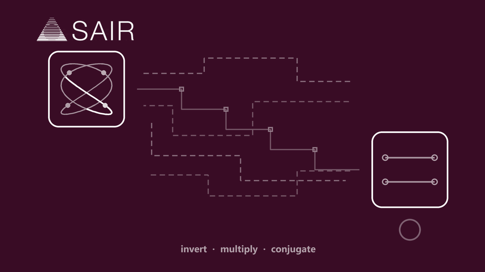
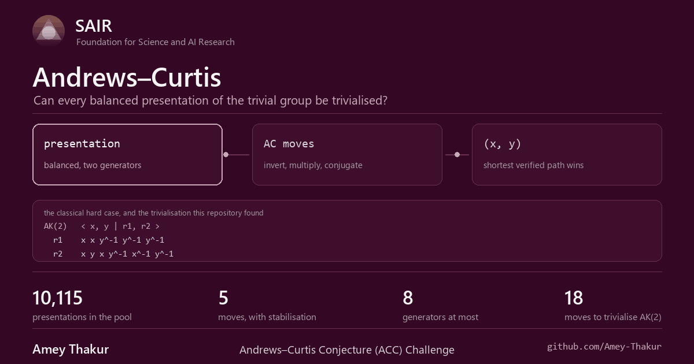

<div align="center">

<a href="https://competition.sair.foundation/competitions/acc/overview" title="SAIR Foundation, open the competition"></a>

# Andrews–Curtis Conjecture Challenge

**Can every balanced presentation of the trivial group be untangled by hand?**

<br>

A balanced presentation has as many defining relations as generators. If it
presents the trivial group, three moves ought to be enough to reduce it to the
standard presentation. Nobody knows whether they always are. This repository
holds the moves, a verifier that will not accept a path it cannot replay, and a
search that is honest about where it stops.

<br>

[Documentation](docs/README.md) &nbsp;·&nbsp;
[The moves](src/README.md) &nbsp;·&nbsp;
[Competition](https://competition.sair.foundation/competitions/acc/overview) &nbsp;·&nbsp;
[Discussions](https://github.com/Amey-Thakur/SAIR-ANDREWS-CURTIS-CHALLENGE/discussions)

<br>

[](https://competition.sair.foundation/competitions/acc/overview)
[](https://competition.sair.foundation/competitions/acc/overview)
[](https://www.python.org/)
[](https://competition.sair.foundation/competitions/acc/overview)
[](https://github.com/Amey-Thakur)
[](LICENSE)

<br>

<a href="https://github.com/Amey-Thakur" title="Amey Thakur on GitHub"></a>

</div>

---

<br>

## The problem

A presentation is **balanced** when it has the same number of generators as
defining relations. Andrews and Curtis asked, in 1965, whether every balanced
presentation of the trivial group can be reduced to the standard one at the
same rank using only elementary moves on the relators.

> Take a balanced presentation of the trivial group. Reduce it to the standard
> presentation using only the moves below, and do it in as few moves as
> possible.

Sixty years later the answer is not known, and the shortest known
trivialisations of many presentations are still being improved by search. Run
by **Caltech and the SAIR Foundation**, co-organised by Lucas Fagan, Sergei
Gukov and Terence Tao.

<br>

## The moves

A **relator** is the word `r` in a defining relation `r = 1`. Each move
replaces one relator and leaves the others alone. Adjacent inverse letters
cancel after every move.

| Move | Replace `r` with | Note |
| :--- | :--- | :--- |
| **Invert** | `r⁻¹` | |
| **Multiply** | `r s` or `r s⁻¹` | `s` is a **different** relator |
| **Conjugate** | `c r c⁻¹` | `c` is a generator or its inverse |

The **stable** version adds two more: introduce a fresh generator `z` together
with the relator `z`, and delete such a pair when `z` occurs in no other
relator.

| Problem | Target | Constraint |
| :--- | :--- | :--- |
| **AC** | the ordered pair `(x, y)` | the two generators stay fixed |
| **Stable AC** | the empty presentation | at most **8** generators at any point |

> [!IMPORTANT]
> The target is an *ordered* pair. A sequence that arrives at `(y, x)` has not
> finished, and the verifier in this repository says so rather than rounding it
> off.

<br>

## Why it is hard

| Difficulty | Why it bites |
| :--- | :--- |
| **The moves lengthen before they shorten** | A greedy descent on total relator length stalls, which is why the hard cases are hard |
| **The branching is wide** | Two relators over two generators already give fourteen ordinary moves at every step |
| **No invariant separates the cases** | Exponent sums survive conjugation, so they refute some presentations cheaply and say nothing about the rest |
| **Stabilising cuts both ways** | Extra generators can shorten a path, and they widen the tree that has to be searched |

<br>

<div align="center">



<sub>The same challenge in brief, with the figures this repository works against.</sub>

</div>

<br>

## What this repository does

The competition's own repository, playground and submission format arrive at
launch. Until then this holds the parts that do not depend on them.

| Path | What it holds |
| :--- | :--- |
| **[docs/](docs/README.md)** | The reading order: the conjecture, the two tracks, what is measured and what is not |
| **[src/ac/](src/ac/)** | Words, balanced presentations, the five moves, and the verifier |
| **[src/search/](src/search/)** | A baseline search, and what it does and does not reach |
| **[src/harness/](src/harness/)** | Check a solution before submitting it |
| [tests/](tests/) | What is actually verified, run with `python -m pytest` |

<br>

## What the baseline reaches

Measured, not claimed. The search is best first on total relator length with a
node budget, run against the Akbulut–Kirby presentations, the classical
candidate counterexamples.

| Case | Result |
| :--- | :--- |
| `AK(2)`, AC | **18 moves**, verified |
| `AK(2)`, stable AC | not found in 60,000 nodes |
| `AK(3)`, AC | not found in 60,000 nodes |

> [!NOTE]
> That pattern is the point rather than a disappointment. Total relator length
> is a weak guide precisely because a trivialisation usually has to lengthen a
> relator before it can cancel it, so a length-guided search finds the easy
> cases and stops. Any real entry has to beat this, and now there is something
> to beat.

<br>

## Run it

Python 3.10 or newer. No third party packages are needed to verify a solution.

```bash
python -m pytest tests -q
```

Check a solution before it is submitted:

```bash
python -m src.harness.check_solution solution.json
```

Attempt a presentation with the baseline:

```bash
python -m src.search.best_first AK 2
```

Both cards in this README are generated. The first follows the competition's
own artwork, the second is this repository's brief:

```bash
python .github/scripts/build_sair_card.py .github/assets
python .github/scripts/build_briefing_card.py .github/assets
python .github/scripts/build_social_preview.py .github/social-preview.png
```

<br>

## Key dates

| | |
| :--- | :--- |
| Registration and team formation open | 8 September 2026 |
| Discovery Track opens | 11 September 2026, 16:00 UTC |
| Proof Track opens | 20 September 2026 |
| Submission deadline, all tracks | 30 November 2026 |

The challenge is experimental, participants carry their own compute costs, and
each person or organisation may join only one team.

<br>

## Reading further

- [The ACC Challenge](https://competition.sair.foundation/competitions/acc/overview), the competition and its rules
- J. J. Andrews and M. L. Curtis, *Free groups and handlebodies*, Proc. Amer. Math. Soc. **16** (1965), where the question is posed
- [Akbulut–Kirby presentations](https://en.wikipedia.org/wiki/Andrews%E2%80%93Curtis_conjecture), the standard candidate counterexamples
- [SAIR Foundation](https://sair.foundation/), and the Zulip community where the challenge is discussed

<br>

---

<div align="center">

**[SAIR Foundation competitions index](https://github.com/Amey-Thakur/SAIR-FOUNDATION-FOR-SCIENCE-AND-AI-RESEARCH)**

Every SAIR challenge, what each one asks, the dates that govern it, and where
the work lives.

<br>

Prepared by **[Amey Thakur](https://github.com/Amey-Thakur)** &nbsp;·&nbsp;
ORCID [0000-0001-5644-1575](https://orcid.org/0000-0001-5644-1575) &nbsp;·&nbsp;
SAIR [ID 25789315](https://sair.foundation/u/25789315)

<sub>Released under <a href="LICENSE">CC BY 4.0</a>, with citation metadata in <a href="CITATION.cff">CITATION.cff</a>.</sub>

</div>
