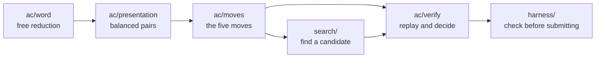

<div align="center">

# The moves

**Five operations, one verifier, and a search that is honest about where it stops.**

[Back to the repository](../README.md) &nbsp;·&nbsp;
[Documentation](../docs/README.md) &nbsp;·&nbsp;
[Competition](https://competition.sair.foundation/competitions/acc/overview)

</div>

---

Each directory knows as little as it can about the others. The moves do not
know what a search is, the search does not know what a submission looks like,
and the verifier does not know how a path was found. That separation is the
whole safeguard: a bad heuristic can then only fail to find a path, never
invent one.



## What each file owns

| File | What it owns |
| :--- | :--- |
| [word.py](ac/word.py) | Words in a free group. A generator is a positive integer and its inverse is the negation, which makes inversion a reversal and free reduction a single stack pass |
| [presentation.py](ac/presentation.py) | Balanced presentations, the two targets, and the Akbulut–Kirby family |
| [moves.py](ac/moves.py) | Invert, multiply, conjugate, stabilise, destabilise, and the refusal of anything else |
| [verify.py](ac/verify.py) | Replaying a sequence and saying where it stopped |
| [best_first.py](../src/search/best_first.py) | A baseline, and a measurement of what a length-guided search cannot reach |
| [check_solution.py](harness/check_solution.py) | The exit code a submission pipeline can read |

## The rule that shapes everything

A move that cannot be applied raises, and the verifier reports the step number.
It never repairs an argument, never skips a move it does not understand, and
never rounds `(y, x)` up to `(x, y)`.

The reason is not tidiness. The only thing that makes a short path valuable is
that it is real, so a verifier that is generous with illegal moves produces a
leaderboard entry for a trivialisation nobody found.

## What the moves preserve

Exponent sums are invariant under conjugation and negated by inversion. That
makes them the cheapest obstruction available: they refute some presentations
outright and say nothing at all about the rest, which is roughly the situation
the whole problem is in.

## Run it

```bash
python -m pytest tests -q
python -m src.harness.check_solution solutions/example.json
python -m src.search.best_first AK 2
```

> [!IMPORTANT]
> The official submission format arrives with the Discovery Track on
> 11 September 2026. The reader in [verify.py](ac/verify.py) follows the
> challenge's own description of a solution, an identifier and a list of moves,
> and will be pointed at the real schema once there is one.

**[Back to the repository](../README.md)** &nbsp;·&nbsp;
**[Read the documentation](../docs/README.md)**
